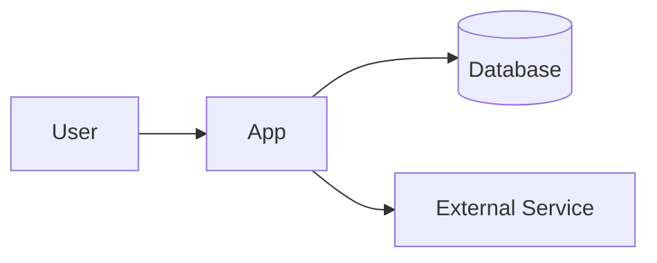

# Architecture — <Product / System>

| Field | Value |
| --- | --- |
| Scope | <whole product / service / subsystem> |
| Last updated | YYYY-MM-DD |

<!-- Use this only when system structure is no longer obvious from the code or README. -->

## Overview

<3–5 sentences describing the system, its main boundaries, and the most important architectural idea.>

## System Context

<!-- Replace this small example with the real system. Keep the diagram high-level. -->

## Components

| Component | Responsibility | Owns / Uses |
| --- | --- | --- |
| <Web / App / Device> | <what it does> | <state/data/resources> |
| <API / Service> | <what it does> | <state/data/resources> |
| <Database / Storage> | <what it stores> | <important data> |

## Main Flow

<!-- Describe the important path, not every internal call. -->

1. <Actor/component> sends <request/event>.
2. <Component> validates/processes it.
3. <Component> reads/writes <data>.
4. <Result/event> returns to <actor/component>.

## Interfaces

<!-- Delete if the system has no important integration boundaries. -->

| From | To | Interface | Purpose |
| --- | --- | --- | --- |
| <Component> | <Component/service> | HTTP / event / serial / file | <why they communicate> |

## Data

| Data | Owner | Storage | Notes |
| --- | --- | --- | --- |
| <Important data> | <component> | <database/storage> | <retention, format, constraint> |

## Constraints

- **<Constraint>** — <how it shapes the architecture>
- **<Constraint>** — <how it shapes the architecture>

## Key Decisions

<!-- Link to decision records instead of repeating their full reasoning. -->

- [<Decision title>](decisions/001-example.md) — <one-line consequence>
